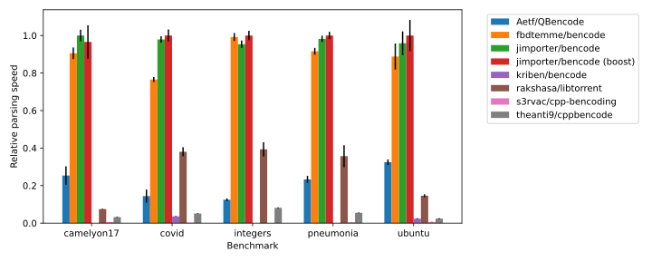
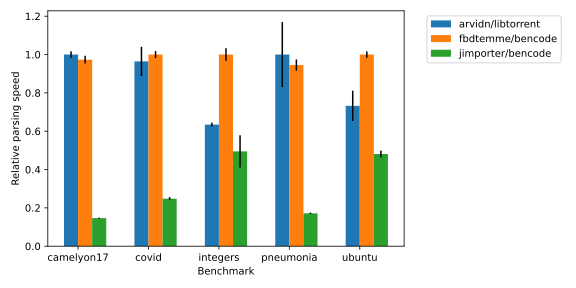

[](https://github.com/fbdtemme/bencode/actions?query=workflow%3Abuild)
[](https://fbdtemme.github.io/bencode/)
[](https://github.com/fbdtemme/bencode/releases)
[](https://isocpp.org/)
[](https://app.codacy.com/manual/floriandetemmerman/bencode?utm_source=github.com&utm_medium=referral&utm_content=fbdtemme/bencode&utm_campaign=Badge_Grade_Dashboard)
[](https://codecov.io/gh/fbdtemme/bencode)
[](https://opensource.org/licenses/MIT)

[**Features**](#Features) |
[**Status**](#Status) |
[**Documentation**](#Documentation) | 
[**Examples**](#Examples) |
[**Building**](#Building) | 
[**Integration**](#Integration) |
[**License**](#License)

A header-only C++20 bencode serialization/deserialization library.

## Features

*   Convenient owning representation of bencoded data with `bvalue`.
*   Fast and memory efficient read-only, non-owning representation into stable buffers of bencoded data with `bview`.
*   Build-in serialization/deserializaton for most standard containers.
*   Support for serializing/deserializing to/from user-defined types. 
*   Parse directly to custom types by satisfying the `EventConsumer` concept.
*   Throwing and non throwing variants of common functions.
*   Iterative parsing to protect against stack overflow attacks.
*   Bencode pointer similar to json pointer.   

## Status

This library is under active development, but should be fairly stable. 
The API may change at any release prior to 1.0.0.

## Documentation

Documentation is available on the [bencode GitHub pages](https://fbdtemme.github.io/bencode/)

## Performance

Decoding performance was benchmarked for both value and view types.
Value types own the data they refer to and thus need to copy data from the buffer with bencoded data.
View types try to minimize copies from the buffer with bencoded data and instead point
to data directly inside the buffer. 

#### Parsing to value types



#### Parsing to view types



Note: libtorrent does not decode integers until they are actually accessed.

## Examples

```cpp
// All examples use namespace bc for brevity
namespace bc = bencode;
```

Decode bencoded data to `bvalue`.

```cpp
//#include <bencode/bencode.hpp> 

namespace bc = bencode;

// decode the data to a descriptor_table
bc::bvalue b = bc::decode_value("l3:fooi2ee");

// check if the first list element is a string
if (holds_list(b) && holds_string(b[0])) {
    std::cout << "success";
}

// type tag based type check, return false
bc::holds_alternative<bc::type::dict>(b); 

// access the first element of the list "foo" and move it 
// out of the bvalue into v1
std::string v1 = bc::get_string(std::move(b[0]));

// access the second element
std::size_t v2 = bc::get_integer(b[1]);
```

Serialize a `bvalue` to an output stream.

```cpp
bc::bvalue b{
  {"foo", 1},
  {"bar", 2},
  {"baz", bc::bvalue(bc::btype::list, {1, 2, 3})},
};

bc::encode_to(std::cout, b);
```

Retrieve data from a bvalue.

``` cpp
auto b = bc::bvalue(bv::type::list, {1, 2, 3, 4, 5, 6, 7, 8, 9});

// return a list of integers as a byte vector, throws on error
auto bytes = get_as<std::vector<std::byte>>(b);

// non throwing version with a std::expected type
auto res = try_get_as<std::vector<std::byte>>(b);

if (res.has_value()) {
    std::cout << res.value(); 
} else {
    std::cout << "error" << to_string(res.error());
}

```

Decode bencoded data to `bview`.

```cpp
//#include <bencode/bview.hpp> 

namespace bc = bencode;

// decode the data to a descriptor_table
bc::descriptor_table t = bc::decode_view("l3:fooi2ee");

// get the bview to the root element (ie the list) 
bc::bview b = t.get_root();

// access data and convert to std::size_t and std::string_view
std::string_view v1 = bc::get_string(b[0]);
std::size_t v2 = bc::get_integer(b[1]);
```


Serialize to bencode using `encoder`.

```cpp
#include <bencode/encode.hpp>
#include <bencode/traits/vector.hpp>    

bc::encoder es(std::cout);

es << bc::begin_dict
       << "foo" << 1UL
       << "bar" << bc::begin_list 
                    << bc::bvalue(1)
                    << "two" 
                    << 3
                << bc::end_list
       << "baz" << std::vector{1, 2, 3}
   << bc::end_dict;
```

Use bpointer to access values in a nested datastructure.

```cpp
bc::bvalue b {
    {"foo", 1},
    {"bar", 2},
    {"baz", bc::bvalue(bc::btype::list, {1, 2, 3})},
};

b.at("baz/2"_bpointer);
```

See the [documentation](https://fbdtemme.github.io/bencode/) for more examples. 

## Building

This project requires C++20. 
Currently only GCC 10 and later is supported.

This library depends on following projects:
*   [fmt](https://github.com/fmtlib/fmt)
*   [gsl-lite](https://github.com/gsl-lite/gsl-lite)
*   [expected-lite](https://github.com/martinmoene/expected-lite)

When building tests:
*   [Catch2](https://github.com/catchorg/Catch2)

When building benchmarks:
*   [google-benchmark](https://github.com/google/benchmark)
*   [libtorrent](https://github.com/arvidn/libtorrent)
*   [jimporter/bencode](https://github.com/jimporter/bencode)
*   [s3rvac/cpp-bencoding](https://github.com/s3rvac/cpp-bencoding)

All dependencies can be fetched from github during configure time if not installed on the system.

The tests can be built as every other project which makes use of the CMake build system.

```{bash}
mkdir build; cd build;
cmake .. -DCMAKE_BUILD_TYPE=Debug -DBENCODE_BUILD_TESTS=ON -DBENCODE_BUILD_BENCHMARKS=OFF =DBENCODE_BUILD_DOCS=OFF
make bencode-tests
```

The library can be installed a CMake package.
```bash
cmake -DBENCODE_BUILD_TESTS=OFF \
      -DBENCODE_BUILD_BENCHMARKS=OFF \
      -DBENCODE_BUILD_DOCS=OFF --build . --target ..
sudo make install
```

## Integration

You can use the `bencode::bencode` interface target in CMake.
The library can be located with `find_package`.

```cmake
# CMakeLists.txt
find_package(bencode REQUIRED)
...
add_library(foo ...)
...
target_link_libraries(foo INTERFACE bencode::bencode)
```

The source tree can be included in your project and added to your build with `add_subdirectory`.

```cmake
# CMakeLists.txt
add_subdirectory(bencode)
...
add_library(foo ...)
...
target_link_libraries(foo INTERFACE bencode::bencode)
```

You can also use `FetchContent` to download the source code from github.
    
```cmake
# CMakeLists.txt
include(FetchContent)

FetchContent_Declare(bencode
  GIT_REPOSITORY https://github.com/fbdtemme/bencode.git
  GIT_TAG "master")

FetchContent_MakeAvailable(bencode)
...
add_library(foo ...)
...
target_link_libraries(foo INTERFACE bencode::bencode)
```

## License

Distributed under the MIT license. See `LICENSE` for more information.