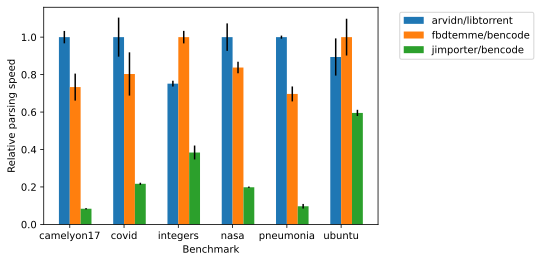

[](https://github.com/fbdtemme/bencode/actions?query=workflow%3Abuild)
[](https://fbdtemme.github.io/bencode/)
[](https://github.com/fbdtemme/bencode/releases)
[](https://isocpp.org/)
[](https://app.codacy.com/manual/floriandetemmerman/bencode?utm_source=github.com&utm_medium=referral&utm_content=fbdtemme/bencode&utm_campaign=Badge_Grade_Dashboard)
[](https://codecov.io/gh/fbdtemme/bencode)
[](https://opensource.org/licenses/MIT)

[**Features**](#Features) |
[**Status**](#Status) |
[**Documentation**](#Documentation) | 
[**Examples**](#Examples) |
[**Building**](#Building) | 
[**Integration**](#Integration) |
[**License**](#License)

A header-only C++20 bencode serialization/deserialization library.

## Features

*   Convenient owning representation of bencoded data with `bvalue`.
*   Fast and memory efficient read-only, non-owning representation into stable buffers of bencoded data with `bview`.
*   Build-in serialization/deserializaton for most standard containers.
*   Support for serializing/deserializing to/from user-defined types. 
*   Parse directly to custom types by satisfying the `EventConsumer` concept.
*   Throwing and non throwing variants of common functions.
*   Iterative parsing to protect against stack overflow attacks.
*   Bencode pointer similar to json pointer.   

## Status

This library is still under development, but should be fairly stable. 
The API may change at any release prior to 1.0.0.

## Documentation

Documentation is available on the [bencode GitHub pages](https://fbdtemme.github.io/bencode/)

## Performance

### Parsing to value types

This benchmarks compares parsing speed when decoding to an owning data type that involves
copying data from the buffer.

Note: libtorrent does not have an owning bencode data type and is thus excluded.


### Parsing to view types

This benchmarks compares parsing speed when decoding to a view type that tries to minimize copies 
from the buffer and instead points to data inside the buffer.

Note: libtorrent does not decode integers until they are actually accessed. 
Both this project en jimporter/bencode parse integers at decode time.



## Examples

Decode a value to a `bvalue`.

```cpp
// All examples use namespace bc for brevity
namespace bc = bencode;
```

```cpp
//#include <bencode/bvalue.hpp> 

using namespace bc::literals;

// create a bvalue from a string literal.
bc::bvalue b = "l3:fooi2ee"_bvalue;
// get a std::string reference to the first value in the lsit
auto& v1 = get_string(b[0]);
// get the integer value of the second value in the list
auto v2 = get_integer(b[1]);
```

Decode a value to a `bview`.

```cpp
//#include <bencode/bview.hpp> 

namespace bc = bencode;

// decode the data to a descriptor_table
bc::descriptor_table t = bc::decode_view("l3:fooi2ee");
// get the bview to the root element (ie the list) 
bc::bview b = t.get_root();
// get a std::string reference to the first value in the lsit
auto& v1 = get_string(b[0]);
// get the integer value of the second value in the list
auto v2 = get_integer(b[1]);
```

Serialize to bencode using `bvalue`.
```cpp
//#include <iostream>
//#include <bencode/bvalue.hpp>
//#include <bencode/encode.hpp>

bc::bvalue b {
  {"foo", 1},
  {"bar", 2},
  {"baz", bc::bvalue(bc::btype::list, {1, 2, 3})},
};

// prints "d3:bari2e3:bazli1ei2ei3ee3:fooi1ee";
bc::encode_to(std::cout, b);
```

Serialize to bencode using `encoder`

```cpp
//#include <bencode/encode.hpp>
//#include <bencode/traits/vector.hpp>

bc::encoder es(std::cout);

es << bc::begin_dict
   << "foo" << 1
   << "bar" << 2
   << "baz" << std::vector{1, 2, 3}
   << end_dict;

// prints "d3:bari2e3:bazli1ei2ei3ee3:fooi1ee";
```
```cpp
// #include <bencode/bencode.hpp>

static const auto b_value = bc::bvalue{
        {"foo", bc::bvalue(bc::btype::list, {"bar", "baz"})},
        {"", 0},
        {"a/b", 1},
        {"c%d", 2},
        {"e^f", 3},
        {"g|h", 4},
        {"i\\j", 5},
        {"k\"l", 6},
        {" ", 7},
        {"m~n", 8}
};

b_value.at("foo/0"_bpointer);    // returns bvalue("bar")
```

See the [documentation](https://fbdtemme.github.io/bencode/) for more examples. 

## Building

This project requires C++20. 
Currently only GCC 10 and later is supported.

This library depends on following projects:
*  [Catch2](https://github.com/catchorg/Catch2)
*  [fmt](https://github.com/fmtlib/fmt)
*  [gsl-lite](https://github.com/gsl-lite/gsl-lite)
*  [expected-lite](https://github.com/martinmoene/expected-lite)
*  [google-benchmark](https://github.com/google/benchmark)


All dependencies can be fetched from github during configure time or can be installed manually.

The tests can be built as every other project which makes use of the CMake build system.

```{bash}
mkdir build
cd build
cmake -DCMAKE_BUILD_TYPE=Debug ..
make 
```

## Integration

You can use the `bencode::bencode` interface target in CMake.
The library can be located with `find_package`.

```cmake
# CMakeLists.txt
find_package(bencode REQUIRED)
...
add_library(foo ...)
...
target_link_libraries(foo INTERFACE bencode::bencode)
```

The source tree can be included in your project and added to your build with `add_subdirectory`.

```cmake
# CMakeLists.txt
# Disable building tests and benchmarks.
set(BENCODE_BUILD_TESTS OFF)
set(BENCODE_BUILD_BENCHMARKS OFF)

add_subdirectory(bencode)
...
add_library(foo ...)
...
target_link_libraries(foo INTERFACE bencode::bencode)
```

You can also use `FetchContent` to download the source code from github.
    
```cmake
# CMakeLists.txt
include(FetchContent)

FetchContent_Declare(bencode
  GIT_REPOSITORY https://github.com/fbdtemme/bencode.git
  GIT_TAG "master")

FetchContent_MakeAvailable(bencode)
...
add_library(foo ...)
...
target_link_libraries(foo INTERFACE bencode::bencode)
```

## License

Distributed under the MIT license. See `LICENSE` for more information.